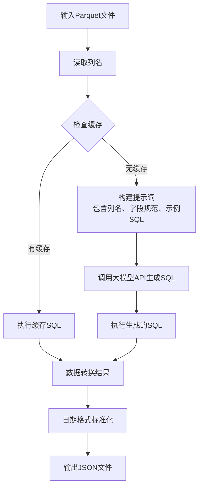
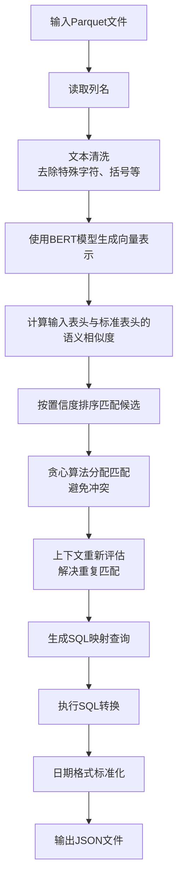
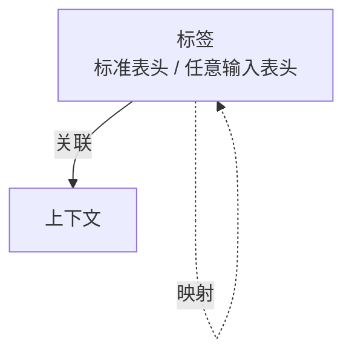

# 基于语义映射的智能Excel数据标准化方案：从规则配置到深度学习的演进

## 引言

在数据处理和ETL（Extract, Transform, Load）流程中，数据源的格式和结构往往千变万化。特别是在处理Excel表格时，不同业务部门、不同数据提供方可能会使用不一致的表头命名规范，这给自动化数据处理带来了巨大挑战。传统的做法通常是手动配置字段映射关系，不仅效率低下，而且难以应对复杂和动态变化的数据源。

在我们的 info-extract 项目中，我们实现了两种表格数据提取方案：基于大语言模型（LLM）的智能SQL生成和基于文本向量相似度的语义匹配。随着项目的发展，我们积累了118份样本数据表的映射结果，这为我们进一步优化数据映射机制提供了宝贵的经验和数据基础。

本文将详细介绍我们现有技术方案的演进过程，分析当前方案的优劣势，并提出一种基于图结构数据集的新型映射关系模型，以期解决现有方案中的不足。

## 现有技术方案：大模型与本地语义匹配

### 方案一：大模型驱动的SQL生成（spreadsheet_extract.py）

我们的第一种方案采用了大语言模型来直接生成SQL转换脚本，这是一种快速冷启动的解决方案。

在 `SpreadsheetExtractor` 类中，我们使用了OpenAI兼容接口的API模型。当系统接收到一个Excel表格（已转换为Parquet格式）时，它会：

1. 读取表格的列名
2. 将列名和预定义的字段规范、示例SQL一起发送给大模型
3. 大模型生成一个SQL查询，将原始列映射到标准字段
4. 使用DuckDB执行生成的SQL，完成数据转换

这种方案的流程如下图所示：

这种方法的优势在于：
- **智能性强**：大模型能够处理复杂的语义映射，即使是从未见过的字段命名也能准确识别
- **灵活性高**：无需预先定义同义词库，模型会自动理解上下文

但这种方法也存在明显的缺点：
- **成本问题**：每次调用API都会产生费用，对于大量数据处理成本较高
- **依赖外部服务**：需要稳定的网络连接和API服务可用性
- **响应时间**：API调用会增加处理延迟

### 方案二：本地语义相似度匹配（dataframe_mapping_extract.py）

为了克服大模型方案的局限性，我们开发了一个纯本地运行的语义匹配方案。

`DataFrameMappingExtract` 使用 `SemanticHeaderNormalizer` 类，基于预训练的BERT模型（text2vec-base-chinese）计算语义相似度。其核心流程是：

1. 将标准字段名及其同义词的描述文本转化为向量表示
2. 将输入表格的表头也转化为向量表示
3. 计算输入表头与标准字段的余弦相似度
4. 使用贪心算法分配匹配，避免一个输入字段被多个标准字段匹配
5. 对于置信度低于阈值的匹配，进行上下文重新评估

这种方案的流程如下图所示：

这种方案的优势在于：
- **成本效益**：纯本地运行，无需API调用费用
- **可控性**：完全在本地环境中运行，不依赖外部服务
- **隐私性**：敏感数据无需离开本地环境

但其局限性也很明显：
- **依赖同义词配置**：需要人工维护标准字段的同义词库，扩展性有限
- **泛化能力有限**：对于未在同义词库中定义的语义表达，可能无法正确匹配

## 挑战与洞察

通过对118份样本数据表的映射结果进行分析，我们发现了以下挑战：

1. **表头命名多样化**：即使是表示同一概念的字段，也有几十种不同的表达方式
2. **上下文依赖**：某些表头的含义需要结合整个表格的表头上下文才能准确理解
3. **新概念涌现**：业务发展会引入新的概念和字段名，需要系统能够快速适应

当前的同义词配置方式在面对这些问题时显得力不从心，需要一种更灵活、更智能的解决方案。

## 提出的解决方案：图结构映射关系模型

基于上述挑战和实际运行数据，我们提出了一种新的映射关系数据集模型：

### 模型设计

- **标签（Label）**：包含标准表头名称和其同义词，标注它们之间的映射关系。
- **上下文（Context）**：指输入表的所有表头集合，为每个表头提供语境信息。
- **映射关系（Mapping）**：标签之间的映射，表示标准表头与输入表头的对应关系。
- **关联关系（Association）**：标签与上下文的关联，记录了在特定上下文中某个输入表头对应的标准表头。

### 工作流程

1. **存储阶段**：将历史处理成功的映射结果以图结构形式存储，每个节点表示一个表头标签，边表示映射关系，同时记录处理时的上下文环境。

2. **检索阶段**：对于新的输入表格，系统首先在存储的数据集中寻找相似的上下文环境，找到与当前输入表头最匹配的上下文。

3. **匹配阶段**：基于找到的相似上下文，识别输入表头可能对应的标准表头，利用历史映射数据提供映射建议。

4. **决策阶段**：当存在置信度低于85%的表头时，启用大模型进行最终判断，以确保映射准确性。

### 优势分析

1. **智能化程度更高**：不仅考虑表头名称的语义相似性，还结合了上下文信息，大幅提高匹配准确性。

2. **自适应性更强**：随着处理的表格增多，模型数据集会不断扩展，系统会变得越来越智能。

3. **成本控制更优**：大部分映射工作可以通过本地检索完成，只在必要时调用大模型，显著降低API成本。

4. **扩展性更好**：无需人工维护同义词库，系统可以自动学习新的映射关系。

## 价值与展望

### 价值主张

1. **效率提升**：通过图结构的数据集，系统能够快速找到相似的映射模式，减少重复的人工配置工作。

2. **准确性增强**：结合上下文信息的映射机制能够更准确地理解表头含义，减少错误匹配。

3. **成本优化**：显著降低对大模型API的调用频率，节省运营成本。

4. **可维护性**：系统自动学习新映射关系，减少了对人工维护同义词库的依赖。

### 未来展望

1. **持续学习**：系统可以实现在线学习，根据用户反馈不断优化映射模型。

2. **多模态支持**：未来可以扩展到处理更复杂的数据格式，如嵌套表格、合并单元格等。

3. **行业特定模型**：针对不同行业建立特定领域的映射模型，进一步提高准确性。

## 结论

从基于大模型的智能SQL生成到基于本地语义匹配的方案，再到即将实施的图结构映射关系模型，我们不断探索和优化Excel数据标准化的技术路径。新的图结构模型不仅结合了上下文信息，实现了更智能的表头匹配，还通过本地化处理和条件式大模型调用有效控制了成本。

这种演进体现了我们在数据处理领域持续创新的努力，也为我们处理更加复杂和多样化的数据源奠定了坚实的基础。随着该模型的不断完善，我们相信它将在各类业务场景中发挥更大的价值。